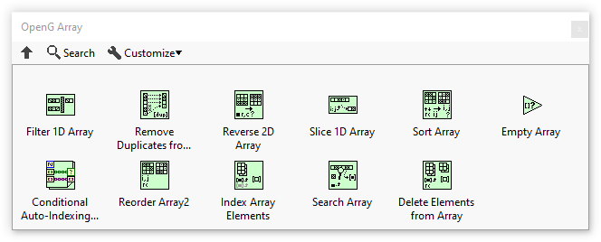

# OpenG Array Library

The OpenG Array Library package contains several routines for operating on array data.

## Installation

[Install the OpenG Array Library with VIPM](https://www.vipm.io/package/oglib_array/) (a.k.a. oglib\_array)

## Overview

### Functions Palette

